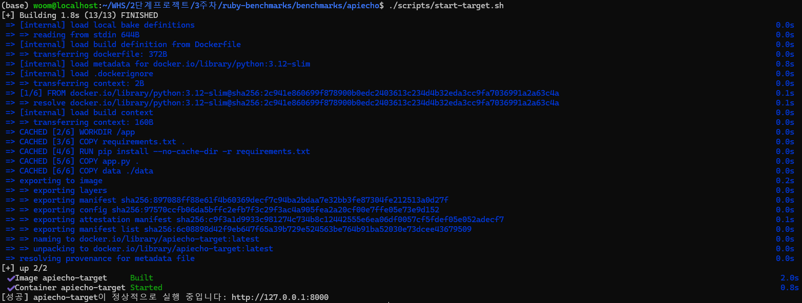
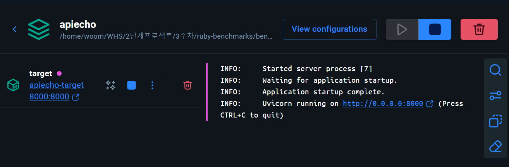
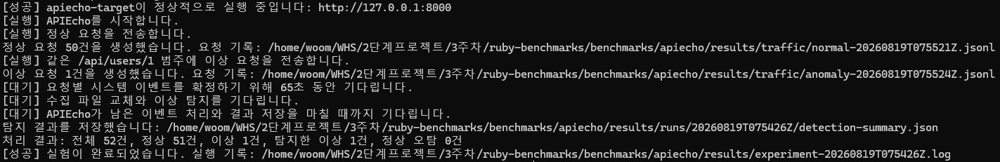
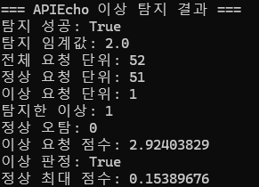

# APIEcho 벤치마크 결과

## 결과 요약

- 결과 상태: 성공
- 발표 화면 실행 ID: `20260819T075426Z`
- 실행 완료 시간: 2026년 8월 19일 07:57:08 UTC
- 탐지 임계값: `2.0`
- 전체 처리 unit: `52개`
- 정상 unit: `51개`
- 이상 unit: `1개`
- 탐지된 이상 unit: `1개`
- 정상 요청 오탐: `0개`

요구한 검증 단계 A~F를 모두 통과했다.

| 단계 | 검증 내용 | 결과 |
|---|---|---|
| A | FastAPI 대상 컨테이너 실행 및 health check | 성공 |
| B | 대상 container ID가 포함된 Sysdig 이벤트 수집 | 성공 |
| C | 요청 delimiter 기반 request unit partition | 성공 |
| D | 반복 정상 요청의 API category 처리 | 성공 |
| E | 동일 API category에 다른 시스템 행위 입력 | 성공 |
| F | `DistanceDetector`의 이상 요청 탐지 | 성공 |

## 실행 증거

### 대상 컨테이너 실행



Docker 이미지 빌드와 `apiecho-target` 컨테이너 시작을 완료했으며, 스크립트의 상태 점검을 통과했다.



Docker Desktop에서도 Uvicorn 프로세스의 시작 완료와 `8000` 포트 연결 상태를 확인했다.

### 벤치마크 완료



정상 요청 50건과 이상 요청 1건을 전송한 후 총 52개 요청 단위가 생성됐다. 이상 요청 1건은 탐지됐고 정상 요청 오탐은 없었다.

### 탐지 점수



화면에 표시된 탐지 결과는 `detection-summary.json`의 집계값과 일치한다.

## 탐지 결과

정상 요청과 이상 요청을 같은 `GET /api/users/1` category에서 비교했다.

| 요청 | Ground truth | 점수 | APIEcho 판정 |
|---|---:|---:|---:|
| `GET /api/users/1?experiment=anomaly` | 이상 | `2.92403829` | `True` |
| `GET /api/users/1` 및 기타 정상 요청 | 정상 | 최대 `0.15389676` | `False` |

이상 요청의 9차원 vector는 다음과 같다.

```text
[0.97467943, 0.97467943, 0.97467943,
 0.97467943, 0.97467943, 0.97467943,
 0.97467943, 0.97467943, 0.97467943]
```

L2 norm은 `2.92403829`로 threshold `2.0`을 초과했다. 정상 요청의 최대 점수는 `0.15389676`으로 threshold보다 낮았으며 오탐은 없었다. 이상 unit에는 정상 unit에 없는 process, file 및 network 관련 특징이 추가됐다.

## 확인한 기능

- Sysdig가 대상 Uvicorn container의 syscall을 수집했다.
- `/dev/null`에 기록한 `python request_start <uuid>.` 및 `python request_end <uuid>.` delimiter가 실제 capture에 포함됐다.
- `PythonAsyncioRequestPartitionHandler`가 delimiter와 HTTP receive 이벤트를 요청별 unit으로 분리했다.
- URI categorization이 query string을 제외해 정상 요청과 이상 요청을 같은 API category로 묶었다.
- 공식 feature extraction 및 vectorization 결과를 `DistanceDetector`가 판정했다.
- 정상 요청 50건과 이상 요청 1건을 자동 생성하고 bounded capture 종료 후 결과를 집계했다.

## 적용한 수정

| 패치 | 내용 |
|---|---|
| `0001-use-modern-bpf-for-wsl.patch` | WSL2용 Docker Sysdig capture backend, delimiter filter 및 bounded capture 처리 |
| `0002-fix-categorizer-required-host-field.patch` | required field를 실제 참조 필드인 `fd.rip`와 일치시킴 |
| `0003-finalize-live-run-on-interrupt.patch` | Live run 종료 시 partitioner, evaluator 및 dumper finalize 보장 |
| `0004-avoid-empty-evaluation-division.patch` | 평가 가능한 unit이 없을 때 division-by-zero 방지 |

FastAPI 시작 시 `python request_start 0.` bootstrap delimiter도 추가했다. 이는 partitioner가 첫 HTTP receive 이벤트 전에 `main_tid`를 초기화하도록 하는 instrumentation이며 탐지 알고리즘 변경은 아니다.

## 공식 결과와의 비교

공식 구현의 request partition, API categorization, feature extraction, vectorization 및 distance 기반 이상 탐지 파이프라인이 실제 Sysdig 이벤트에서 동작하는 것을 확인했다. 이상 요청은 탐지되고 비교한 정상 요청은 모두 정상으로 분류됐다.

논문 원문에 사용된 전체 데이터셋과 정량 평가 조건이 공개되지 않아 논문의 성능 수치와 직접 비교하지는 못했다. 이번 결과는 공식 구현의 end-to-end 실행 가능성과 단일 안전 anomaly 시나리오의 탐지 여부를 검증한 것이다.

## 제한사항

- 단일 anomaly 유형을 한 번만 입력했으므로 일반적인 탐지 성능을 의미하지 않는다.
- Threshold `2.0`은 이번 실험 설정값이며 충분한 정상 분포를 기반으로 조정한 값이 아니다.
- WSL2 환경에서는 Docker Desktop 내부 Sysdig helper를 사용해 native Ubuntu와 capture topology가 다르다.
- 단일 Uvicorn worker와 순차 요청만 검증했다. 동시 asyncio 요청은 별도 검증이 필요하다.
- Live Sysdig 입력에는 `malicious` ground truth가 없어 traffic manifest와 query parameter로 실제 label을 관리했다.
- 원본 scap, JSONL 및 상세 로그는 대용량이므로 팀 저장소에 포함하지 않았다.

## 증거 자료

로컬 실험 디렉터리의 다음 파일을 기준으로 결과를 확인했다.

```text
results/runs/20260819T075426Z/detection-summary.json
results/runs/20260819T075426Z/dump_results/GET _api_users_1.txt
results/runs/20260819T075426Z/sysdig-smoke.log
results/runs/20260819T075426Z/output.jsonl
results/traffic/normal-20260819T075521Z.jsonl
results/traffic/anomaly-20260819T075524Z.jsonl
results/captured/capture.scap*
```

## 다음 실험

1. 여러 anomaly 유형을 반복해 score 분포를 측정한다.
2. 정상 요청 분포를 바탕으로 threshold를 조정한다.
3. 서로 다른 path ID 10개 이상으로 API template merge를 검증한다.
4. 동시 asyncio 요청에서 partitioner의 단일 `current_unit_id` 한계를 측정한다.
5. Native Ubuntu 공통 서버에서 host Sysdig 방식으로 재검증한다.
